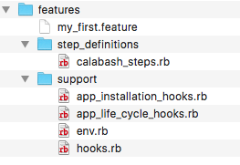

Criando Projeto
---------------

A gem do calabash-android possui um gerador para facilicar a criação do projeto de teste, abra o terminal e execute o seguinte comando:

```
$ calabash-android gen
```

Ele ira criar o seguinte conteúdo:

<div style="text-align:center" markdown="1">
    
</div>

É importante usar o gerador, pois o mesmo já cria os arquvios de configuração para executar o teste.

Configurar Keystore
-------------------

Você pode informar para o calabash onde que se encontra sua keystore de assinatura e credencias.

Crie o arquivo **.calabash_settings** no diretório que você executou o comando de geração do projeto. E agora adicione o seguinte contéudo:

```
{
    "keystore_location":"<caminho_da_keystore>",
    "keystore_password":"<senha_da_keystore>",
    "keystore_alias":"<alias>",
    "keystore_alias_password":"<senha_do_alias>"
}
```

Executando o teste
------------------

Caso você não tenha configurado a keystore do seu apk, o primeiro passo é reassinar o seu build com o seguinte comando:

```
calabash-android resign <apk>
```

Depois de assinado é preciso criar o test-server:

```
calabash-android build <apk>
```

E por fim só executar o teste:

```
calabash-android run <apk>
```
