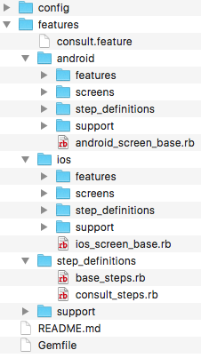
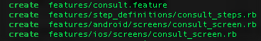

CS:BDD
======

É uma gem para criar a estrutura de um projeto calabash com suporte a Android e iOS. Antes de começar a usar o CS:BDD recomendo que você leia os tutorias específico por plataforma, nós links abaixo:

1.	[iOS](ios.md)
2.	[Android](android.md)

Antes de começar é importante você verificar se a versão do seu ruby é igual ou superior a 2.0 com o seguinte comando:

	$ ruby -v

Caso ainda não tenha instalado o calabash siga o nosso tutorial de instalação, clicando [aqui](install.md).

Instalação
----------

```
gem install cs-bdd
```

Criando projeto
---------------

```
cs-bdd new <nome_do_projeto>
```

Por padrão o projeto é criado no idioma inglês, caso deseja criar em entrou idioma é preciso acrescentar o parâmetro **--lang=** especificado o idioma:

```
cs-bdd new <nome_do_projeto> --lang=pt
```

Depois do projeto criado, ele terá a seguinte estrutura:

<div style="text-align:center" markdown="1">
    
</div>

Generators
----------

O cs-bdd possuiu nove gerados, para criar templates de Features, Step definitions e Screens. E todos gerados tem suporte a outros idiomas, é só adicionar o parâmetro **--lang=**.

Todos os comandos de generate devem ser executados no diretório raiz do projeto.

#### Feature

```
cs-bdd generate feature <nome_da_feature>
```

Android:

```
cs-bdd generate aFeature <nome_feature_android>
```

iOS:

```
cs-bdd generate iFeature <nome_feature_ios>
```

O generate feature por default já cria os arquivos de step definitions e screens.

<div style="text-align:center" markdown="1">
    
</div>

#### Setps

```
cs-bdd generate step StepName
```

Android:

```
cs-bdd generate aScreen <nome_step_android>
```

iOS:

```
cs-bdd generate iScreen <nome_step_ios>
```

Android
-------

Para executar o teste é preciso definir o profile, através do parâmetro "-p".

```
calabash-android run <apk> -p android
```

iOS
---

Antes de executar o projeto de iOS é preciso configurar o arquivo build_app.yml para definir o xcworkspace, o targert do Calabash e onde será gerado o App.

O build_app.yml encontra-se em config/scripts/ios/build_app.yml .

```
dev:
    xcworkspace: "<diretorio_do_xcworkspace>"
    scheme: <nome_target>
    configuration: Debug
    export_path: "<diretorio_onde_sera_gerado_o_.app>"
```

Depois de configurado o build_app.yml, execute o comando:

```
ruby config/scripts/ios/build_app.rb dev simulator
```

O primeiro parâmetro é referente ao ambiente que você criou e o segundo é para criar um build para o simulador (simulator) ou para o aparelho (device).

E por fim, para executar o teste execute o comando abaixo:

```
APP_BUNDLE_PATH=<diretior_do_executavel> DEVICE_TARGET=<uuid_do_aparelho> cucumber -p ios
```
