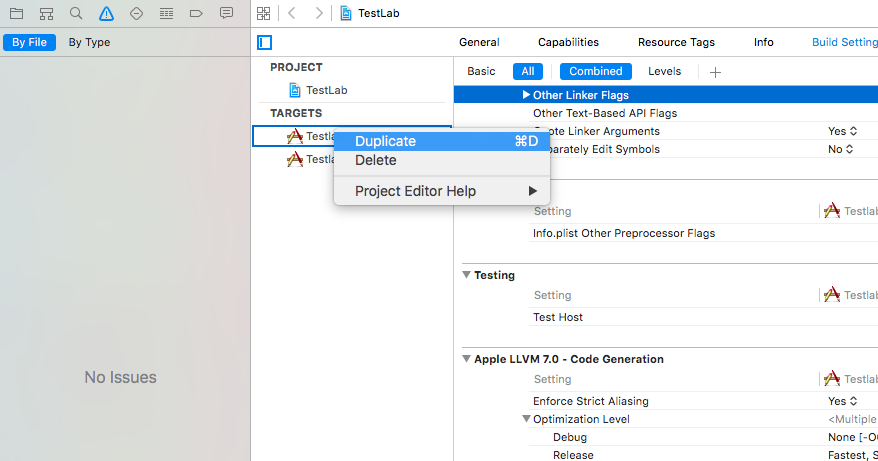
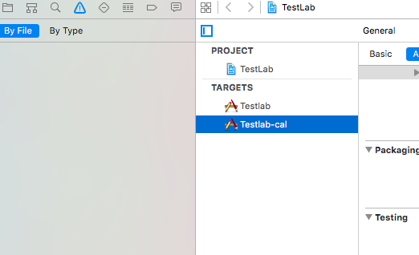
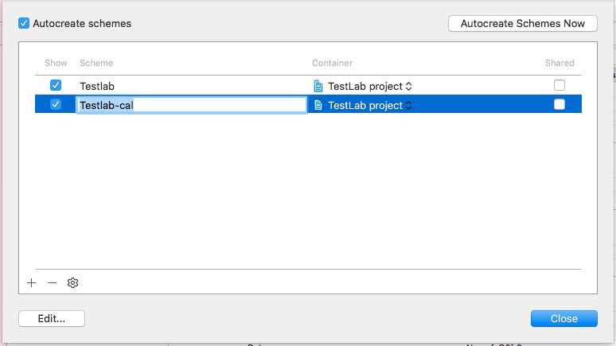
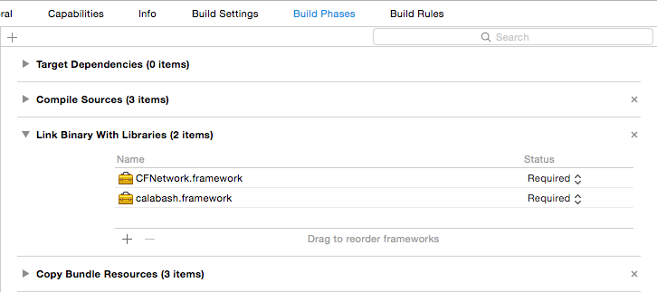
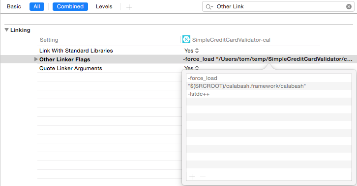

#Criando Projeto

O primeiro passo para configurar o calabash em projetos iOS é baixar o framework na pasta raiz do projeto, basta executar o comando abaixo:

	$ calabash-ios download

O comando irá baixar o **calabash.framework** na pasta raiz do projeto.

##Configurando um novo target

Abra o seu projeto iOS no Xcode, e duplique o target.

<div style="text-align:center" markdown="1">
    
</div>

Em seguida renomei o target duplicado acrescentando o pós-fix -cal. Exemplo:

<div style="text-align:center" markdown="1">
    
</div>

E por ultimo é preciso renomear o scheme em **Project > Scheme > Manage Schemes**.

<div style="text-align:center" markdown="1">
    
</div>

##Adicionar Calabash Framework

Selecione o target Testlab-cal e click na aba Build Phases, em **Link Binary With Libraries** adiciona o **calabash.framework** que foi baixado no inicio do tutorial, e também inclua o **CFNetwork.framework**.

<div style="text-align:center" markdown="1">
    
</div>

E por fim precisamo fazer um link para o framework do calabash na aba Build Settings > **Other Linker Flags**. Adicione a seguinte linha:

	-force_load "$(SRCROOT)/calabash.framework/calabash" -lstdc++


<div style="text-align:center" markdown="1">
    
</div>

##Calabash Server 

E por fim, vamos testar se está tudo funcionando, execute a aplicação no Xcode verifique se o target Testlab-cal está selecionado.

Agora execute o seguinte comando:

	$ curl http://localhost:37265/version
	
Se o servidor Calabash está sendo executado, ele retornará informações sobre a versão do Calabash em JSON.

```` json
{
  "device_family": "iPhone",
  "outcome": "SUCCESS",
  "server_port": 37265,
  "simulator_device": "iPhone",
  "simulator": "CoreSimulator 201.3 - Device: iPhone 6 - Runtime: iOS 9.2 (13C75) - DeviceType: iPhone 6",
  "app_name": "",
  "app_version": "1",
  "screen_dimensions": {
    "sample": 1,
    "height": 1334,
    "width": 750,
    "scale": 2
  },
  "git": {
    "revision": "3bf68ff",
    "remote_origin": "git@github.com:calabash/calabash-ios-server.git",
    "branch": "master"
  },
  "device_name": "iPhone Simulator",
  "4inch": false,
  "app_id": "ciandt.com.Testlab",
  "form_factor": "iphone 6",
  "system": "x86_64",
  "version": "0.16.4",
  "iOS_version": "9.2",
  "short_version_string": "1.0",
  "ios_version": "9.2",
  "iphone_app_emulated_on_ipad": false,
  "model_identifier": "iPhone7,2",
  "app_base_sdk": "iphonesimulator9.2"
}
````

##Executando

O calabash-ios não possui a funcionalidade de instalar o app no simulador, então antes de executar o teste é preciso executar o app pelo XCode, não esqueça de usar o target criado no passo anterior.

Depois de instalado o app, você precisa do UUID do simulador para configurar a variável de ambiente DEVICE_TARGET. E para recupera a lista de UUID's dos simuladores use o seguinte comando:

	xcrun simctl list

Exemplo de UUID:

	iPhone 6 (4FC36C3E-A9F5-4D16-B3B2-977CD54B9B82)

E por fim vamos executar o teste com o comando abaixo:

	DEVICE_TARGET=uuid_do_simulador cucumber
	
Caso você tenha problemas de timeout para iniciar o simulador do iOS, basta adicionar o paramentro abaixo no início do comando, o valor é em segundos:

	WAIT_TIMEOUT=60

